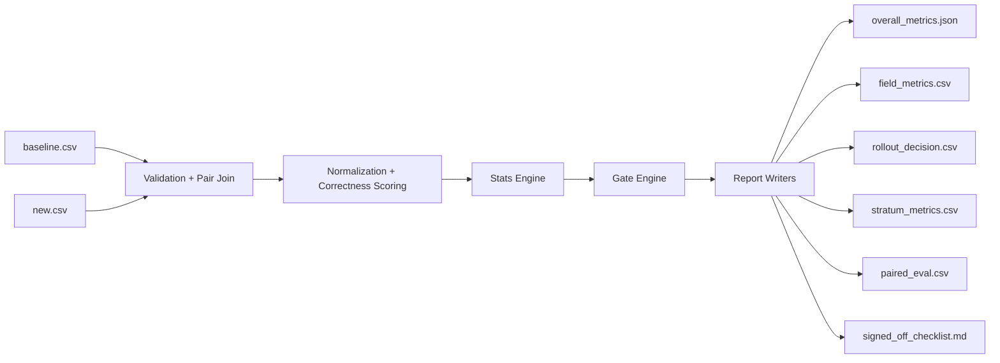
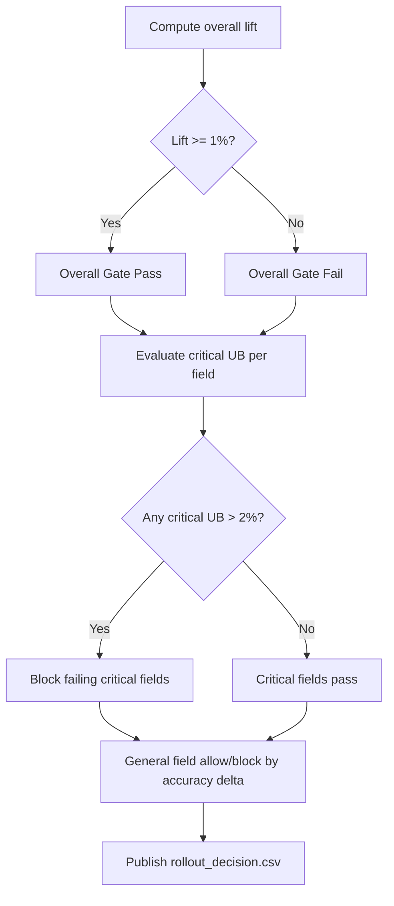

# Prompt Stat Eval Architecture Presentation

## 1. Objective
- Evaluate a new prompt set vs baseline for trade confirmation field extraction.
- Use paired statistical analysis to decide safe rollout.
- Protect high-risk fields using strict regression-risk gates.

## 2. Business Problem
- Overall quality may improve while critical fields regress.
- A single aggregate score is not enough for release decisions.
- Need explainable, auditable, and field-level rollout control.

## 3. System Scope
- Inputs:
  - `baseline.csv`
  - `new.csv`
- Core processing:
  - validation
  - normalization
  - paired scoring
  - statistics
  - rollout gating
  - reporting
- Outputs:
  - `paired_eval.csv`
  - `overall_metrics.json`
  - `field_metrics.csv`
  - `stratum_metrics.csv`
  - `rollout_decision.csv`
  - `signed_off_checklist.md`

## 4. High-Level Architecture

## 5. Code Component Map
- Package root: `src/prompt_stat_eval/`
- `config.py`
  - runtime configuration (`EvalConfig`)
- `validation.py`
  - schema checks, duplicate keys, join coverage, paired dataset construction
- `normalize.py`
  - missing handling, date/amount/rate/currency/text normalization + correctness logic
- `stats.py`
  - McNemar, bootstrap CI, Clopper-Pearson, metric tables, parse-threshold fail-fast
- `reporting.py`
  - writes CSV/JSON/Markdown deliverables
- `pipeline.py`
  - orchestrates end-to-end run
- UI:
  - `streamlit_app.py`
- Optional local generator (outside main codebase):
  - `local_tools/synthesize_trade_data.py`

## 6. Data Contract
- Required columns in both input CSVs:
  - `deal_id`, `deal_type`, `template`, `field_name`, `golden_truth`, `generated_value`
- Join key:
  - `(deal_id, field_name)`
- Fail-fast checks:
  - missing required columns
  - duplicate keys
  - join key mismatch above threshold
  - golden truth mismatch for same joined key
  - parse-failure rate above threshold

## 7. Field Model
- Tier 1 (Critical, 5 fields):
  - `trade_date`, `notional_amount`, `settlement_date`, `maturity_date`, `currency`
- Tier 2 (General, 15 fields):
  - `payment_date`, `issue_date`, `effective_date`, `coupon_rate`, `coupon_frequency`, `day_count_convention`, `business_day_convention`, `reference_rate_index`, `spread_bps`, `rate_type`, `clean_price`, `accrued_interest`, `settlement_amount`, `trade_side`, `counterparty_name`
- Field type mapping:
  - hardcoded by `field_name`
  - fallback type: `text`

## 8. Correctness Logic
- Missing token handling:
  - `""`, `NO_DATA_FOUND`, `NULL`, `N/A` (case-insensitive)
- Date:
  - parse as `DD/MM/YYYY` (minor day/month width variation accepted)
  - compare canonical date values
- Amount/Rate:
  - parse numeric values from realistic formatted strings
  - tolerance:
    - `abs(x - y) <= max(0.01, 1e-4 * max(1, |y|))`
- Currency:
  - normalized exact match
- Text:
  - normalized exact match
- Missing gold policy:
  - missing/missing = correct
  - missing/present = incorrect
  - present/missing = incorrect

## 9. Statistical Engine
- Paired accuracy:
  - `Acc_old`, `Acc_new`, `Lift = Acc_new - Acc_old`
- Disagreement counts:
  - `b = improvements`, `c = regressions`
- Evidence:
  - exact one-sided McNemar via binomial
- Uncertainty:
  - paired bootstrap 95% CI for lift

## 10. Gate Design
- Overall gate:
  - pass if `Lift >= 0.01`
- Critical field safety gate:
  - for each critical field, compute regression upper bound (95% Clopper-Pearson)
  - pass if `ub <= 0.02`
- General field rollout rule:
  - `ALLOW` if `Acc_new >= Acc_old`, else `BLOCK`
- Important:
  - overall gate and critical gates are independent checks

## 11. Decision Flow

## 12. Output Artifacts
- `paired_eval.csv`
  - row-level paired correctness + improvement/regression flags
- `overall_metrics.json`
  - global accuracy, lift, CI, McNemar, join/parse diagnostics
- `field_metrics.csv`
  - per-field performance, missing stats, critical UB/pass
- `stratum_metrics.csv`
  - grouped by `deal_type` and `template`
- `rollout_decision.csv`
  - field-level `ALLOW/BLOCK` + reason
- `signed_off_checklist.md`
  - release-ready summary

## 13. Runtime Interfaces
- CLI:
  - `prompt-stat-eval --baseline data/baseline.csv --new data/new.csv --output-dir outputs`
- UI:
  - `streamlit run streamlit_app.py`

## 14. Operational Considerations
- Reproducibility:
  - controlled bootstrap seed
- Auditability:
  - deterministic outputs for same inputs/config
- Safety:
  - fail-fast on bad joins / gold mismatches / excessive parse failures
- Usability:
  - simplified Streamlit flow: upload files and run with code defaults

## 15. Suggested Future Enhancements
- Add a unified `final_release_decision` in `overall_metrics.json`.
- Add export to PowerPoint-compatible format.
- Add drift dashboard across evaluation runs.
